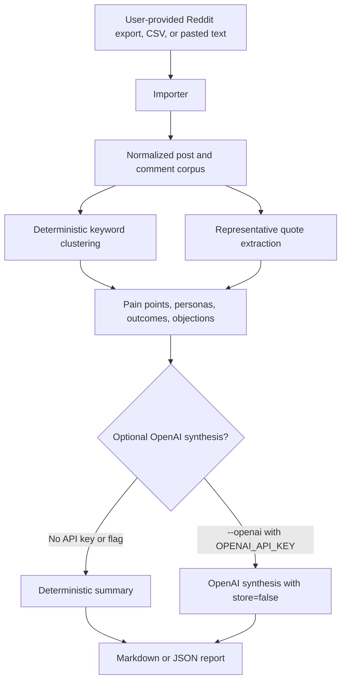

# Reddit Market Lens

Reddit Market Lens is a TypeScript CLI that turns Reddit exports, CSVs, and pasted Reddit-like notes into market research reports. It helps teams move from scattered posts and comment threads to a structured view of pain points, personas, desired outcomes, objections, representative quotes, and recommended next steps.

The tool is designed for user-provided data only. It does not scrape Reddit, bypass authentication, log in to Reddit, or collect private data.

## Who It Is For

- Founders validating a product idea against real customer language.
- Product managers comparing repeated problems across communities before prioritizing roadmap work.
- Marketing teams mining voice-of-customer quotes for positioning, landing pages, objections, and campaigns.
- User researchers turning exported discussion data into an evidence-backed research handoff.
- Operators and consultants who need a quick first-pass market lens before deeper interviews.

## Real-World Use Cases

- A founder exports threads from relevant subreddits and checks whether users describe the same manual workflow pain often enough to justify a prototype.
- A PM imports support-adjacent Reddit comments to compare desired outcomes against the current roadmap.
- A marketer reviews objections and quotes before writing comparison pages, sales enablement notes, or ad concepts.
- A researcher clusters posts by persona and pain point, then uses the quote citations to decide which claims need follow-up interviews.
- An agency analyzes public discussion exports for a client and delivers a Markdown or JSON evidence report.

## How It Works



## Importers

Reddit Market Lens accepts three input styles:

- JSON: arrays, Reddit listings with `data.children`, single Reddit-like objects, or objects with `posts` and `comments` arrays.
- CSV: common headers such as `type`, `id`, `title`, `body`, `selftext`, `comment`, `subreddit`, `author`, `score`, `parent_id`, `post_id`, `link_id`, `created_utc`, `url`, and `permalink`.
- Text: pasted notes split on blank lines. Blocks starting with `Comment:` or `Reply:` are treated as comments; lines like `r/startups - Title` capture subreddit and title.

Each importer normalizes records into the same typed corpus with stable IDs, post/comment kind, source metadata, subreddit, author, score, timestamps, URLs, parent IDs, and post IDs where available. Duplicate IDs are collapsed before analysis.

## Clustering, Quotes, And Reports

The analyzer uses deterministic taxonomy matching rather than hidden training data. It currently clusters four categories:

- Pain points: manual workflow, trust and accuracy, unexpected costs, and integration gaps.
- Personas: finance leaders, founders and operators, and technical admins.
- Desired outcomes: reliable exports, faster workflows, and clear pricing.
- Objections: price sensitivity, security concerns, and switching friction.

Records are scored by keyword evidence and Reddit score. Quote extraction ranks useful sentences by signal terms, length, and source score, then deduplicates similar text. Markdown reports include an executive summary, market signal sections, representative quotes with source metadata, recommended next steps, and optional synthesis. JSON reports return the full analysis object for downstream workflows.

OpenAI synthesis is optional. When `--openai` is not used, no API key is configured, or the API call fails, the CLI falls back to deterministic synthesis.

## Setup

Requirements:

- Node.js 22 or newer.
- npm.

Install dependencies and build:

```bash
npm install
npm run build
```

Optional local configuration:

```bash
cp .env.example .env.local
```

On Windows PowerShell:

```powershell
Copy-Item .env.example .env.local
```

Then edit `.env.local` locally. Do not commit `.env.local`, `.env`, exports, source data, or generated reports that include private or sensitive information.

## Safe Environment Configuration

`.env.example` documents optional settings without secrets:

```dotenv
# Optional. Leave blank unless using --openai.
OPENAI_API_KEY=

# Optional. Used only when --openai is set.
OPENAI_MODEL=gpt-5-mini
```

The CLI loads `.env.local` first and then `.env` if either file exists. Both are ignored by Git. The optional OpenAI request uses the Responses API with `store: false` and sends only the supplied clusters and quotes needed for synthesis.

## Commands

Analyze a JSON export and print Markdown:

```bash
npm run dev -- analyze ./reddit-export.json --format json
```

Analyze CSV and write a Markdown report:

```bash
npm run dev -- analyze ./reddit-export.csv --format csv --out report.md
```

Analyze pasted text from stdin:

```powershell
Get-Content .\reddit-notes.txt | npm run dev -- analyze - --format text --title "Buyer Research"
```

Render JSON:

```bash
npm run dev -- analyze ./reddit-export.json --report json --out report.json
```

Use optional OpenAI synthesis:

```bash
npm run dev -- analyze ./reddit-export.json --openai
```

Set `OPENAI_API_KEY` in ignored local configuration before using `--openai`.

CLI options:

```text
reddit-market-lens analyze <input>
  --format <auto|json|csv|text>
  --out <path>
  --report <markdown|json>
  --title <title>
  --openai
  --min-cluster-size <count>
```

Development and release checks:

```bash
npm run lint
npm run typecheck
npm test
npm run build
npm audit --audit-level=moderate
npm outdated
npm run public:check
git diff --check
```

## Codebase Structure

```text
src/cli.ts                  CLI argument parsing, env loading, stdin/file IO
src/importers/              JSON, CSV, and text importers
src/analysis/               Taxonomy clustering, quote extraction, synthesis
src/report/                 Markdown and JSON report rendering
src/text-utils.ts           Normalization, IDs, timestamps, sentence helpers
src/types.ts                Shared TypeScript types
tests/                      Importer, clustering, quote, and report coverage
scripts/check-public-surface.mjs
                            Public repository safety checks
.github/workflows/ci.yml    CI verification for pushes and pull requests
.github/dependabot.yml      Scheduled npm and GitHub Actions update checks
```

## Privacy, Security, And Reddit Data Notes

- Use only data you are allowed to export, paste, analyze, and share.
- Treat Reddit exports as potentially sensitive because usernames, links, quotes, and community context can identify people.
- Review generated reports before sharing them outside your team.
- Avoid committing raw exports, private research notes, generated reports with personal data, `.env`, `.env.local`, or API keys.
- The project does not include private-auth scraping behavior and should stay limited to user-provided exports and pasted text.
- Optional OpenAI synthesis sends selected clusters and quotes to the configured OpenAI model. Leave `--openai` off for fully local deterministic analysis.
- CI runs linting, typechecking, tests, build, public-surface checks, `npm audit --audit-level=moderate`, and `npm outdated`.
- Dependabot is configured to check npm packages and GitHub Actions on a weekly schedule.

## Public Repository Expectations

This repository is intended to stay public-safe:

- `README.md` is the only tracked Markdown file.
- `.env.example` is tracked as a safe template.
- Local agent notes, Obsidian folders, `.codex`, env files, source exports, and generated workflow logs should remain untracked.
- Commits and project docs should stay free of attribution markers, generated-by language, bot trailers, and secrets.
