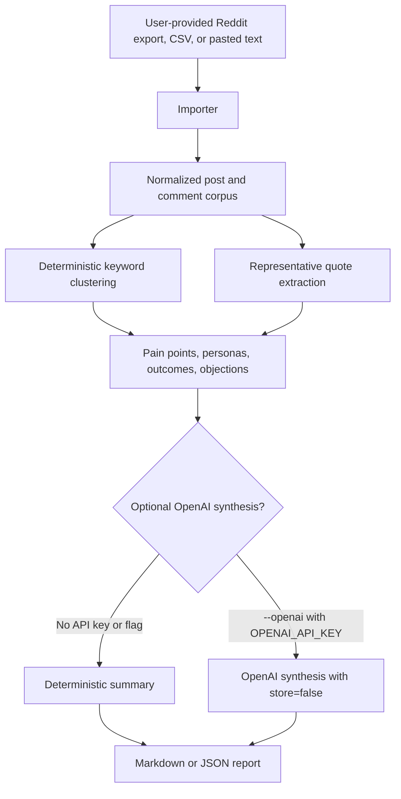

# Architecture

The diagram source is [architecture.mmd](architecture.mmd).

## How it works



## Importers

Reddit Market Lens accepts three input styles:

- JSON: arrays, Reddit listings with `data.children`, single Reddit-like objects, or objects with `posts` and `comments` arrays.
- CSV: common headers such as `type`, `id`, `title`, `body`, `selftext`, `comment`, `subreddit`, `author`, `score`, `parent_id`, `post_id`, `link_id`, `created_utc`, `url`, and `permalink`.
- Text: pasted notes split on blank lines. Blocks starting with `Comment:` or `Reply:` are treated as comments; lines like `r/startups - Title` capture subreddit and title.

Each importer normalizes records into the same typed corpus with stable IDs, post/comment kind, source metadata, subreddit, author, score, timestamps, URLs, parent IDs, and post IDs where available. Duplicate IDs are collapsed before analysis.

## Clustering, quotes and reports

The analyzer uses deterministic taxonomy matching rather than hidden training data. It currently clusters four categories:

- Pain points: manual workflow, trust and accuracy, unexpected costs, and integration gaps.
- Personas: finance leaders, founders and operators, and technical admins.
- Desired outcomes: reliable exports, faster workflows, and clear pricing.
- Objections: price sensitivity, security concerns, and switching friction.

Records are scored by keyword evidence and Reddit score. Quote extraction ranks useful sentences by signal terms, length, and source score, then deduplicates similar text. Markdown reports include an executive summary, market signal sections, representative quotes with source metadata, recommended next steps, and optional synthesis. JSON reports return the full analysis object for downstream workflows.

OpenAI synthesis is optional. When `--openai` is not used, no API key is configured, or the API call fails, the CLI falls back to deterministic synthesis.

## Source files

```text
src/cli.ts                  CLI argument parsing, env loading, stdin/file IO
src/importers/              JSON, CSV, and text importers
src/analysis/               Taxonomy clustering, quote extraction, synthesis
src/report/                 Markdown and JSON report rendering
src/text-utils.ts           Normalization, IDs, timestamps, sentence helpers
src/types.ts                Shared TypeScript types
tests/                      Importer, clustering, quote, and report coverage
scripts/check-public-surface.mjs
                            Public repository safety checks
.github/workflows/ci.yml    CI verification for pushes and pull requests
.github/dependabot.yml      Scheduled npm and GitHub Actions update checks
```
